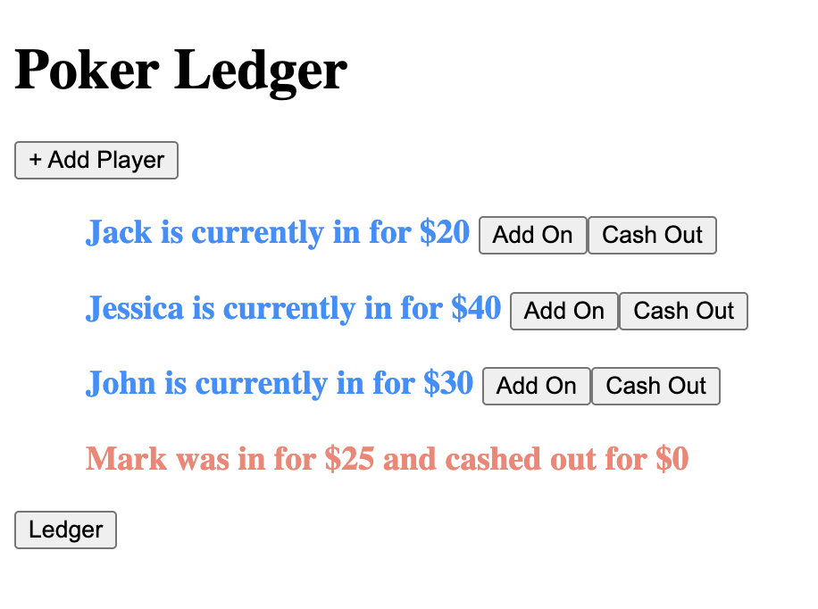
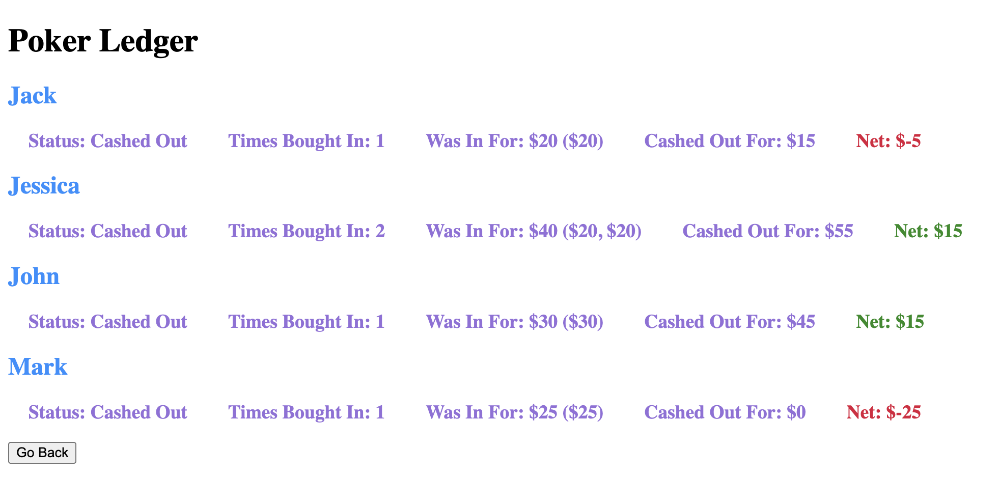

# 🃏 Poker Ledger

[](LICENSE)

Track buy-ins, cash-outs, and net balances — built for poker nights with friends or semi-serious home games. Poker Ledger is a clean, intuitive tool for keeping tabs on who's in for what.

---

## 🚀 Features

- Add and manage players
- Record multiple buy-ins and cash-outs
- Instantly calculate net balances
- Clean and responsive UI
- Persistent storage with MongoDB

---

## 🧱 Tech Stack

**Frontend**  
- React + TypeScript  
- Vite  

**Backend**  
- Node.js + Express.js  
- MongoDB (via Mongoose)

---

## 📸 Screenshots

### 🎮 Main Screen


### 📊 Ledger View


---

## 🛠️ Getting Started

1. **Clone the repository**
2. Run `npm install` in both the `frontend/` and `backend/` folders
3. Create a `.env` file in the `backend/` folder with:
   ```env
   PORT=5005
   MDB_URI=your_mongodb_connection_string
4. Run `npm run dev` in first the `backend/` then `frontend/` folders
